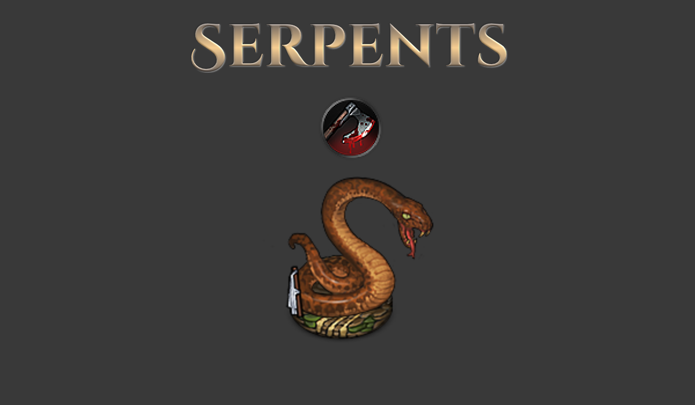
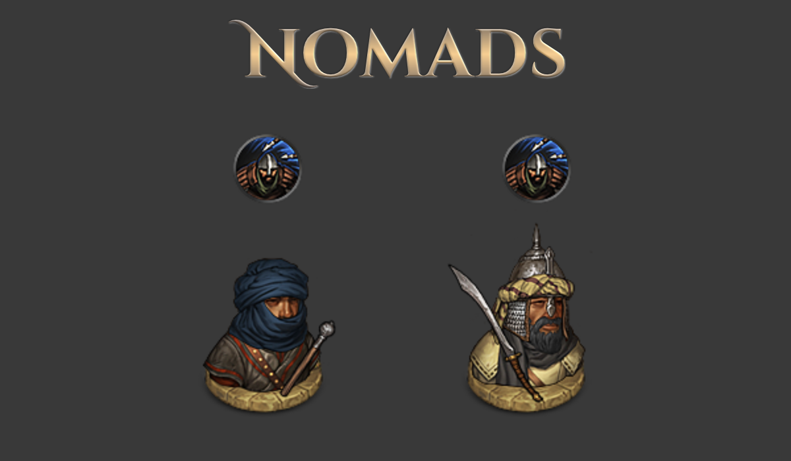
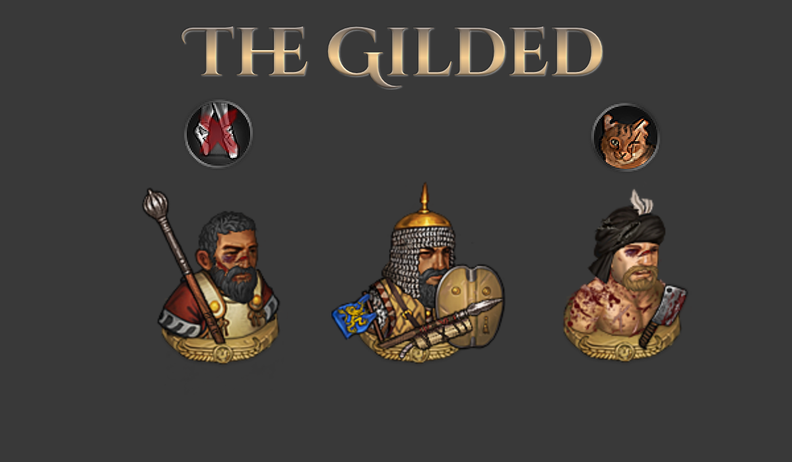
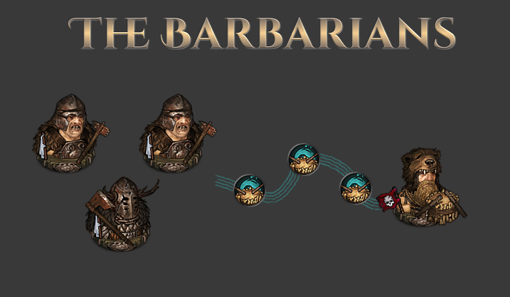
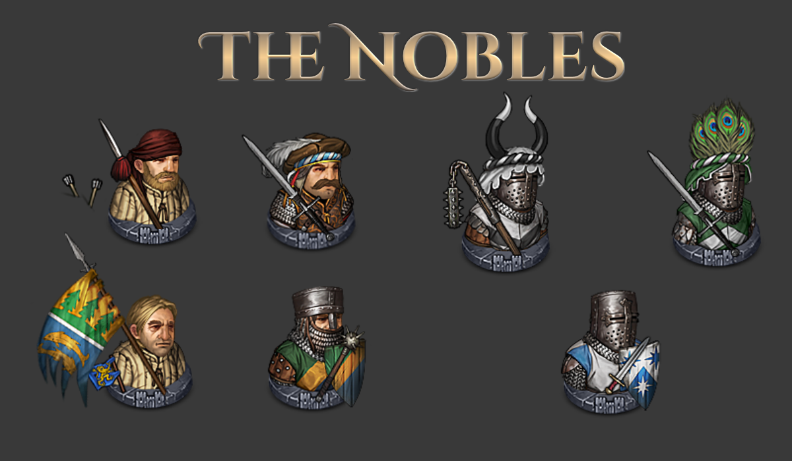

# Sato's Enemy Balance

A mod for the game Battle Brothers ([Steam](https://store.steampowered.com/app/365360/Battle_Brothers/), [GOG](https://www.gog.com/game/battle_brothers), [Developer Site](http://battlebrothersgame.com/buy-battle-brothers/)).

## Table of contents

-   [Features](#features)
-   [Requirements](#requirements)
-   [Installation](#installation)
-   [Uninstallation](#uninstallation)
-   [Compatibility](#compatibility)
-   [Building](#building)

## Features

Rebalances a number of enemy factions and units that I felt were out of sync with the game's overall difficulty curve. Any balance change in a game as tightly balanced as Battle Brothers will likely be controversial, so I've attempted to capture my thoughts on each change in a [separate document](./reasoning.md). I don't expect it to satisfy anyone, but you can judge for yourself.

This mod only changes enemies themselves - for more holistic balance changes, look at my [balance mod](https://github.com/jcsato/sato_balance_mod).

- Serpent Resolve reduced to 80 (down from 100)
- Serpent's Bite skill now does 40-60 damage (down from 50-70)
- Serpents Bite skill now has 90% armor effectiveness (up from 75%)
- Serpents now have the Executioner perk

- Lindwurms' Gorge skill now has 25% armor ignore (down from 35%)
- Lindwurm unit cost increased to 105 (up from 90)

- Nomad Cutthroats and Outlaws have the Dodge perk starting from day 1
- Nomad Cutthroat Melee and Ranged Defense reduced to -5 (down from 5)
- Nomad Outlaw Melee and Ranged Defense reduced to 5 (down from 15)
- At day 35 Cutthroats and Outlaws gain +5 Melee and Ranged Defense, and another +5 at day 70
- Nomads no longer ignore morale checks for the deaths of friendly Indebted units

- Polearm Conscripts no longer have the Nimble perk
- Indebted now have the Nine Lives perk

- Barbarian Thralls, Reavers, Chosen, and Drummers no longer have the Brawny perk
- Beastmasters and Drummers no longer have the Dodge perk
- Drummers no longer have the Recover perk
- Reaver and Chosen Fatigue Recovery per turn reduced to 17 (down from 20)
- Reaver Resolve reduced to 60 (down from 80), Chosen Resolve reduced to 75 (down from 90)
- Reaver unit cost increased to 28 (up from 25)
- Chosen unit cost increased to 38 (up from 35)
- Barbarian Unhold unit cost increased to 58 (up from 55)
- There are 4 new spawn compositions for barbarians for low numbers of Chosen with Reavers (e.g. 6 Reavers, 2 Chosen)
- Barbarian Camps now have 170 resources for spawning defenders (down from 180)
- Barbarian Sanctuaries now have 310 resources for spawning defenders (down from 325)
- The Drums of War skill no longer reduces Fatigue directly; instead, it applies an effect that lasts for 2 turns and gives +3 Fatigue Recovery per turn and +15 Resolve

- If the late game crisis is active, Footman can spawn with the "Closed Mail" and "Faceguard" versions of their helmets and with Reinforced Mail Hauberks - if Beasts & Exploration is installed, they can additionally spawn with Footmen's Armor and Three Headed Flails
- If the late game crisis is active, Footmen will no longer spawn with Mail Coifs or Basic Mail Shirts (their worst armor options)
- Billmen Ranged Defense increased to 15 (up from 5)
- Standard Bearer Resolve increased to 130 (up from 80)
- Knights can, depending on their faction's traits, now spawn with Scale Armor, Lamellar Harnesses, Heavy Lamellar Armor, Greatswords, Greataxes, and Two Handed Hammers - if Beasts & Exploration is installed, Two Handed Flanged Maces, Two Handed Flails, and Three Headed Flails also become options, and if Warriors of the North is installed, Bardiches also become an option
- Knights will, depending on their faction's traits, have one of Backstabber, Duelist, Fortified Mind, Fearsome, Lone Wolf, Head Hunter, or Anticipation, in addition to their normal perks
- If Beasts & Exploration is installed, Zweihanders can spawn with Noble Mail

If [Equipment Variants](https://github.com/jcsato/sato_equipment_variants_mod) is installed, Zweihanders who spawn with Noble Mail will do so in faction-appropriate colors.

If [Additional Equipment](https://github.com/jcsato/sato_additional_equipment_mod) is installed, Footmen who normally spawn with nasal helmets can spawn with the "Faceguard" nasal helmet added by that mod when a late game crisis is active.

## Requirements

1) [Modding Script Hooks](https://www.nexusmods.com/battlebrothers/mods/42) (v20 or later)

## Installation

1) Download the mod from the [releases page](https://github.com/jcsato/sato_enemy_balance_mod/releases/latest)
2) Without extracting, put the `sato_enemy_balance_*.zip` file in your game's data directory
    1) For Steam installations, this is typically: `C:\Program Files (x86)\Steam\steamapps\common\Battle Brothers\data`
    2) For GOG installations, this is typically: `C:\Program Files (x86)\GOG Galaxy\Games\Battle Brothers\data`

## Uninstallation

1) Remove the relevant `sato_enemy_balance_*.zip` file from your game's data directory

## Compatibility

This should be fully save game compatible, i.e. you can make a save with it active and remove it without corrupting that save. Scaling on Barbarian camps may take some time to readjust.

### Building

To build, first copy the contents of `ini.cfg.example` to a new `ini.cfg` file and set `modkitpath` and `datapath` appropriately. Then, simply run the included `build.bat` script. This will compile and zip the mod and put it in the `dist/` directory - it will also print out any compilation errors, if any are present. The zip behavior requires Powershell / .NET to work, but there's no reason you couldn't sub in 7-zip or another compression utility if you know how and want to.

After building, you can install the mod by running the included `install.bat` script. This will take any existing versions of the mod already in your data directory, append a timestamp to the filename, and move them to an `old_versions/` directory in the mod folder; then it will take the built `.zip` in `dist/` and move it to the data directory.
